# 🧠 Optimizing LLMs: Local Quantization (CPU vs GPU)

This project compares the performance of different quantization methods for **Large Language Models (LLMs)** — specifically **DistilGPT-2** and **GPT-2** — under various hardware precision settings on **Google Colab T4 GPU**.

---

## 📘 Objective
To measure and analyze how precision settings affect:
- **Latency (s)**
- **Token generation speed (tokens/sec)**
- **GPU memory usage (VRAM GB)**
- **Overall efficiency of model inference**

---

## ⚙️ Environment Setup

**Recommended runtime:** Google Colab (GPU T4)

### 1️⃣ Install dependencies
```bash
!pip -q uninstall -y bitsandbytes triton torch torchvision torchaudio transformers

# Install PyTorch with CUDA 12.6
!pip -q install --index-url https://download.pytorch.org/whl/cu126 \
  torch==2.8.0 torchvision==0.23.0 torchaudio==2.8.0

# LLM + Quantization dependencies
!pip -q install transformers==4.45.2 accelerate sentencepiece bitsandbytes==0.45.2 triton==3.4.0

```

2️⃣ Verify environment
python
Copy code
import torch, transformers, bitsandbytes as bnb, pathlib
print("Torch:", torch.__version__)
print("Transformers:", transformers.__version__)
print("CUDA available:", torch.cuda.is_available())
libs = [p.name for p in pathlib.Path(bnb.__file__).parent.glob('libbitsandbytes_cuda*.so')]
print("bitsandbytes libs:", libs)
🧩 Models Tested
Model	Parameters	Description
distilgpt2	82M	Lightweight distilled version of GPT-2
gpt2	124M	Standard GPT-2 model for text generation

🧪 Experiment Setup
Each model was tested under 4 settings:

CPU FP32 — Baseline without GPU acceleration

GPU FP16 — Half precision (16-bit float)

GPU INT8 — 8-bit quantization

GPU INT4 — 4-bit quantization

Each experiment generated 128 and 256 tokens for latency and speed comparison.

📊 Results Summary
🟣 DistilGPT-2
|    Setting   | Max New Tokens | Latency (s) | Tokens/sec | VRAM (GB) |
| :----------: | :------------: | :---------: | :--------: | :-------: |
| **CPU FP32** |       128      |    7.244    |    10.49   |     –     |
| **GPU FP16** |       128      |    1.167    |    65.15   |    0.17   |
| **GPU INT8** |       128      |    1.567    |    48.50   |    0.31   |
| **GPU INT4** |       128      |    0.797    |    95.39   |    0.42   |
| **CPU FP32** |       256      |    8.754    |    15.99   |     –     |
| **GPU FP16** |       256      |    1.707    |    82.02   |    0.18   |
| **GPU INT8** |       256      |    2.731    |    51.27   |    0.31   |
| **GPU INT4** |       256      |    1.931    |    72.50   |    0.42   |

🔵 GPT-2
|    Setting   | Max New Tokens | Latency (s) | Tokens/sec | VRAM (GB) |
| :----------: | :------------: | :---------: | :--------: | :-------: |
| **CPU FP32** |       128      |    11.896   |    11.77   |     –     |
| **GPU FP16** |       128      |    3.133    |    44.69   |    0.59   |
| **GPU INT8** |       128      |    4.521    |    30.96   |    0.59   |
| **GPU INT4** |       128      |    1.910    |    73.31   |    0.64   |
| **CPU FP32** |       256      |    14.517   |    18.46   |     –     |
| **GPU FP16** |       256      |    5.636    |    47.55   |    0.51   |
| **GPU INT8** |       256      |    6.904    |    38.82   |    0.57   |
| **GPU INT4** |       256      |    2.880    |    93.07   |    0.62   |


📈 Tokens/sec Bar Charts
Below are bar charts comparing generation speed (tokens/sec) across all modes for each model and token length.

DistilGPT-2 — Max New Tokens = 128

```mermaid
xychart-beta
    title "DistilGPT-2 — Tokens/sec (128)"
    x-axis ["CPU FP32","GPU FP16","GPU INT8","GPU INT4"]
    y-axis "Tokens/sec" 0 --> 100
    bar "Speed" [10.49,65.15,48.50,95.39]
```

DistilGPT-2 — Max New Tokens = 256

```mermaid
xychart-beta
    title "DistilGPT-2 — Tokens/sec (256)"
    x-axis ["CPU FP32","GPU FP16","GPU INT8","GPU INT4"]
    y-axis "Tokens/sec" 0 --> 90
    bar "Speed" [15.99,82.02,51.27,72.50]
```


GPT-2 — Max New Tokens = 128


GPT-2 — Max New Tokens = 256


🔰 Combined Comparison
DistilGPT-2 — Compare 128 vs 256


GPT-2 — Compare 128 vs 256


Observation:

INT4 is consistently the fastest in both models.

FP16 follows closely with efficient VRAM usage.

INT8 trades some speed for memory savings.

CPU FP32 is too slow for real-time inference.

###🧠 Reflection

After testing both DistilGPT-2 and GPT-2, the GPU INT4 mode showed the best balance between speed and memory usage.
INT4 reached up to 95 tokens/sec for DistilGPT-2 and 93 tokens/sec for GPT-2, using only 0.4–0.6 GB of VRAM.
FP16 produced slightly more stable text, but the quality difference was minimal for short outputs.
INT8 provided average performance and memory efficiency, while CPU FP32 was the slowest and unsuitable for real-time generation.

###✅ Conclusion:

INT4 is the most efficient setting, offering the highest speed with minimal VRAM — ideal for limited-resource environments like free Colab GPUs.

##🧑‍💻 Author

Pongsatron Phooduong
Software Engineering Student, Mae Fah Luang University

💡 Keywords

LLM • Quantization • BitsAndBytes • INT4 • Performance Comparison • Colab GPU


